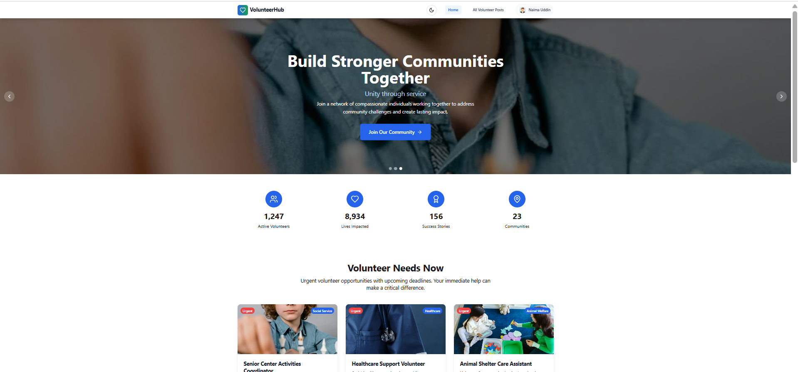
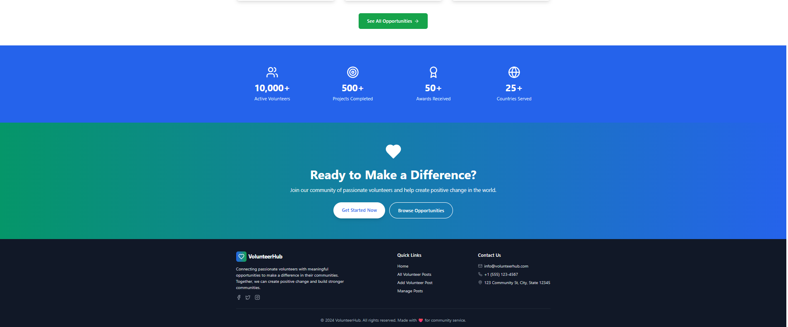

# 🤝 Volunteer Connect App

🔗 **Live Site**: [https://volunteermanagement-gules.vercel.app](https://volunteermanagement-gules.vercel.app)

🌍 **Volunteer Connect** – A modern and responsive platform built with **React**, **Firebase**, and **MongoDB** that allows users to create, manage, and join volunteer opportunities seamlessly.

---

## 📸 Screenshot

  


*(Replace with your actual screenshot URLs or local paths)*

---

## 🛠️ Technologies Used

- **React + TypeScript**
- **Firebase Authentication**
- **React Router DOM**
- **React Hook Form**
- **Tailwind CSS**
- **DaisyUI**
- **Framer Motion**
- **React Hot Toast**
- **Lucide React (Icons)**
- **Date-fns**
- **MongoDB (backend)**

---

## ✨ Key Features

- 🔐 **Firebase Auth** – Email & Google login
- 📝 **Volunteer Post Management** – Create, update, delete posts
- 🧾 **Join Requests** – Submit requests via modal forms
- 📋 **My Requests** – Track joined volunteer requests
- 🧑‍💼 **My Posts** – View and manage your created posts
- 🔒 **JWT-secured Routes** – Protected dashboard features
- 🌙 **Dark/Light Mode** – Toggle with Tailwind theme
- 🔍 **Search & Sort** – Search posts and sort by deadline
- 🧭 **404 Page** – Custom not-found route
- ⏳ **Loading States** – Smooth spinners during data fetch
- 📱 **Responsive Design** – Fully mobile-friendly

---

## 📦 Frontend Dependencies

| Package                    | Version     |
|----------------------------|-------------|
| **react**                  | ^18.3.1     |
| **react-dom**              | ^18.3.1     |
| **react-router-dom**       | ^6.22.0     |
| **react-hook-form**        | ^7.50.0     |
| **firebase**               | ^10.7.1     |
| **react-hot-toast**        | ^2.4.1      |
| **framer-motion**          | ^11.0.0     |
| **react-datepicker**       | ^4.25.0     |
| **lucide-react**           | ^0.344.0    |
| **date-fns**               | ^3.3.0      |
| **vite**                   | ^5.4.2      |
| **tailwindcss**            | ^3.4.1      |
| **daisyui**                | ^5.0.43     |
| **typescript**             | ^5.5.3      |
| **eslint** + config tools  | ^9.9.1+     |
| postcss, autoprefixer, etc. – CSS tooling |

---

# 📦 Volunteer Connect Backend API

🔗 **Live API**: [https://volunteer-management-server-steel.vercel.app](https://volunteer-management-server-steel.vercel.app)

This is the backend API built with **Node.js**, **Express.js**, and **MongoDB (Mongoose)**. It manages volunteer posts, request handling, and integrates securely with the frontend through **CORS** and **environment-based configuration**.

---

## ⚙️ Backend Features

- 🛠️ **Express.js REST API** – Modular route handling
- 🍃 **MongoDB Atlas** – Cloud database via Mongoose
- 🔐 **Environment Variables (.env)** – Secure Mongo URI handling
- 🌐 **CORS** – Configured for frontend integration
- 📁 **Data Models** – Volunteer posts, users, requests
- 🔄 **CRUD Operations**:
  - `GET /posts` – Fetch all posts
  - `POST /posts` – Add a new post
  - `PUT /posts/:id` – Update a post
  - `DELETE /posts/:id` – Remove a post
  - `POST /requests` – Submit a join request
  - `GET /requests?email=user@mail.com` – View user requests

🚫 **Note**: Authentication handled in frontend via Firebase. Backend verifies JWT for protected routes.

---

## 🧑‍💻 Run Locally

**1️⃣ Clone the Repository**
```bash
git clone https://github.com/your-username/volunteer-connect.git
cd volunteer-connect

2️⃣ 📦 Install Dependencies
npm install

3️⃣ 🔐 Set up Environment Variables
Create a .env file in the root and add your Firebase + Backend API config:
VITE_FIREBASE_API_KEY=your_api_key
VITE_FIREBASE_AUTH_DOMAIN=your_auth_domain
VITE_FIREBASE_PROJECT_ID=your_project_id
VITE_FIREBASE_APP_ID=your_app_id
VITE_BACKEND_URL=https://volunteer-management-server-steel.vercel.app
📝 Note: Never commit your .env file. Add it to .gitignore.

4️⃣ 🚀 Run the App
npm run dev

5️⃣ 📦 Build for Production
npm run build


🔗 Links & Resources
🌐 Live Site: https://volunteermanagement-gules.vercel.app

📁 Client GitHub Repo: add your GitHub repo link

🔥 Firebase Docs: https://firebase.google.com/docs

🍃 MongoDB Docs: https://www.mongodb.com/docs


❤️ Feel free to fork, clone, and contribute to improve this project!
